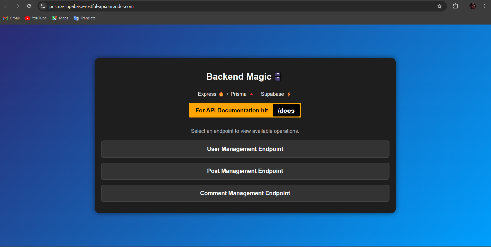
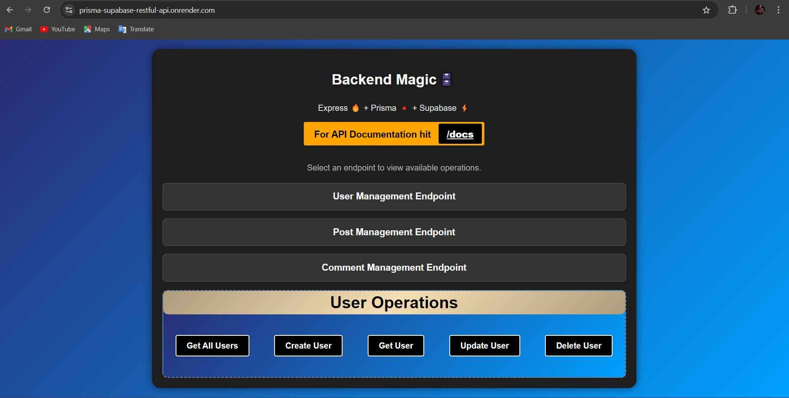
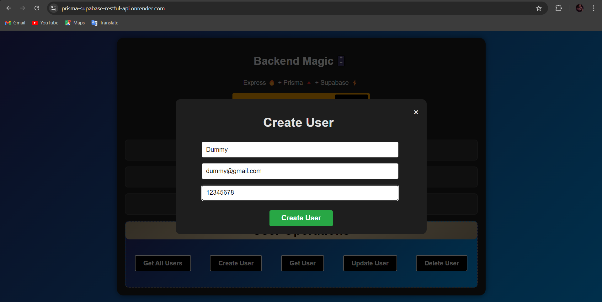
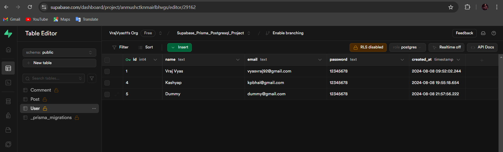
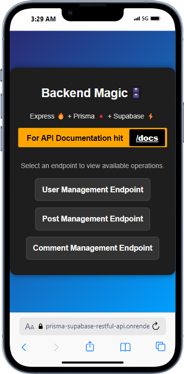
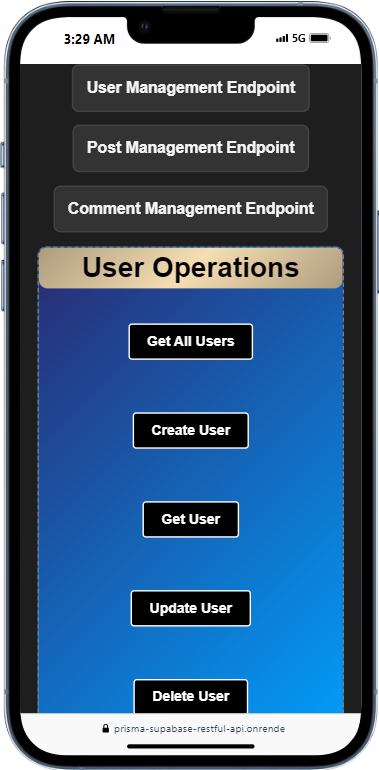
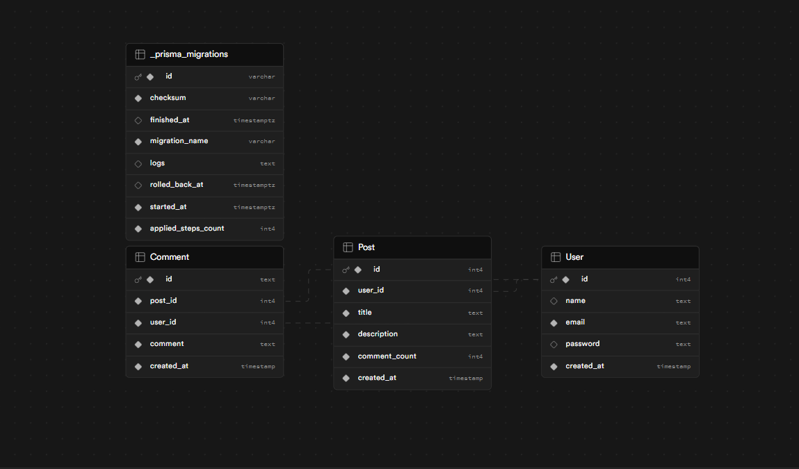
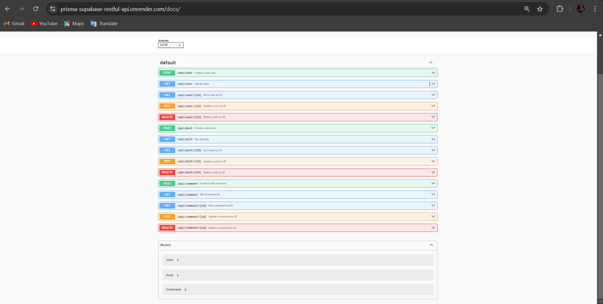

### REST API With Prisma + Supabase

``` This Project is  For Learning Perpopse only. ```

### Live Link ---->>> [Live Link](https://prisma-supabase-restful-api.onrender.com)

### Docker Image url --->>> [prisma_supabase_restapi](https://hub.docker.com/r/vrajvyas/prisma-supabase-restful-api)

This api is learning purpose only and it 's tech stack is below
### Node + Express
### Prisma
### Supabse(Postgresql)
### Docker(containerization)

### Below is screenshot

### API Testing Website





### Api Website Mobile Responsive




### Database (Table) Diagram


### Api Swagger Documentation



## Contributing

## Getting Started

Follow these steps to set up the project on your local machine:

1. **Fork the Repository:**
   - Click on the "Fork" button at the top right corner of this repository's GitHub page.

2. **Clone the Forked Repository:**
   To clone the repository, use the following command:
```bash
git clone https://github.com/VrajVyas11/Prisma_Supabase_RestFul_Api.git
```

You can copy this command and paste it into your terminal to clone the project repository.

3. **Navigate to the Project Directory:**
     cd Prisma_Supabase_RestFul_Api

4.**Install Dependencies:
       Ensure you have Node.js and npm installed, then run: **

         npm install

5. **Set Up Environment Variables:
Create a .env file in the root directory and add the necessary environment variables as specified in .FakeENV.**
